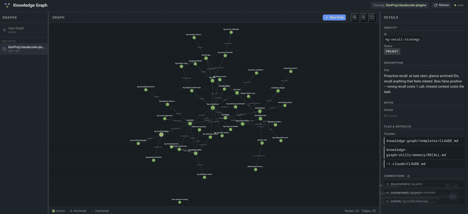

# Claude Code Plugins

A marketplace of Claude Code plugins for persistent memory and enhanced workflows.

## Available Plugins

### Knowledge Graph

Gives Claude a persistent memory that survives across sessions — not flat notes, but a graph of nodes and typed relationships. Claude distills insights as you work, connects them to related knowledge, and recalls the right context automatically next session.



---

**[Full documentation →](knowledge-graph/README.md)** — setup, configuration, skill reference

**[Wiki →](https://github.com/mironmax/claudecode-plugins/wiki)** — design decisions, how it works, API reference

---

## Quick Install

```
/plugin marketplace add mironmax/claudecode-plugins
/plugin install knowledge-graph@maxim-plugins
```

Restart Claude Code. Done.

**Also recommended:**
- Disable built-in auto-memory — ⚙ Settings → Memory → toggle Auto-memory **off**. Otherwise two memory systems run in parallel and write conflicting entries.
- Enable plugin auto-updates — run `/plugin`, pick **Marketplaces** → `maxim-plugins` → **Enable auto-update**. Off by default for third-party marketplaces.

---

## Contributing

Have a plugin to add? Open a PR with updates to `.claude-plugin/marketplace.json`.

## License

Each plugin has its own license. See individual plugin directories for details.
