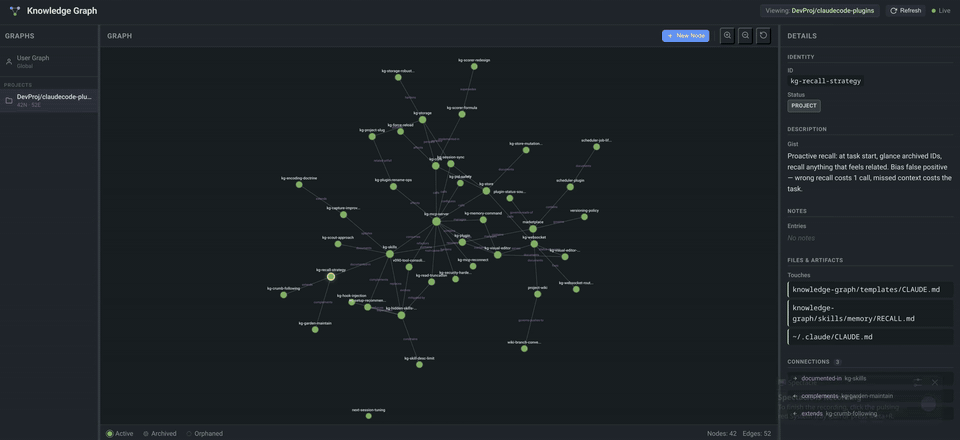

# kg-memory: knowledge-graph memory for Claude Code, Codex and Antigravity

Persistent memory for coding agents: the agent remembers across sessions as a graph of nodes and typed relationships, not flat notes. It captures insights as you work, preloads them next session, and brings back the right memory when a prompt or a file needs it. The graph also tracks when it needs tending, and can tend itself in the background. Claude Code and Codex CLI share one memory, so what one learns the other knows; Antigravity CLI support is experimental.



## Install

```bash
uv tool install kg-memory     # needs uv: https://docs.astral.sh/uv/
kg setup                      # asks before each change, backs up what it edits
```

No uv yet? `curl -LsSf https://raw.githubusercontent.com/mironmax/kg-memory/main/install.sh | sh` installs it and runs both steps. Asking an agent to install it? Point it at [INSTALL.md](INSTALL.md).

`kg setup` finds Claude Code, Codex CLI, Antigravity CLI (experimental) and Claude Desktop, connects each of them (the knowledge-graph plugin, or Desktop's config), and runs one local memory server for all of them (a systemd user service on Linux). `kg doctor` checks everything afterwards; `kg update` keeps it current.

Two steps are yours: in Codex, run `/hooks` and trust the knowledge-graph hooks (Codex keeps plugin hooks off until you approve them); restart Claude Desktop. Then start a new session. Platform notes: [Codex](knowledge-graph/README.md#codex-cli) · [Antigravity](knowledge-graph/ANTIGRAVITY.md).

Requires Python 3.10+. The graph is stored locally, with no database or API key; memories the agent reads reach its model provider like any other context.

**[Full documentation →](knowledge-graph/README.md)** · **[Wiki →](https://github.com/mironmax/kg-memory/wiki)** · ⭐ Star if useful — it helps others find this

## Your first five minutes

You don't operate the graph; the agent does. After install:

1. **Start any session.** The memory preload arrives with it, and after its first full read the agent says *"I have recalled KG Memories"*. Empty at first; that's normal.
2. **Just work.** The agent captures insights as you go: decisions, preferences, debugging discoveries, how your codebase fits together.
3. **Seed it faster (optional):** `/kg-extract` maps your codebase architecture into the graph; `/kg-scout` mines your past Claude Code sessions and Codex rollouts for knowledge you've already paid for.
4. **Next session, ask:** *"What do you remember about this project?"* That's the moment it clicks.

**Also recommended:**
- Turn off the harness's own memory, or two memory systems write conflicting entries. Claude Code: ⚙ Settings → Memory → Auto-memory **off**. Codex: its `memories` feature is off by default; leave it off.
- Enable plugin auto-updates in Claude Code: `/plugin` → **Marketplaces** → `maxim-plugins` → **Enable auto-update** (off by default for third-party marketplaces).
- Adopt the **[recommended user-level setup](recommended-setup/)** for Claude Code: an output style carrying a working agreement, and a status line. The earlier v2 response rules measured −27% output tokens; the combined v3 style has not been re-benchmarked. For Codex, the **[Codex setup](recommended-setup/codex.md)** loads the same style as developer instructions and configures the native footer. The **[Antigravity setup](recommended-setup/antigravity.md)** loads it as a global rule and adds a quota status line.

These docs track the current source, including unreleased changes. See the [changelog](CHANGELOG.md) for release boundaries.

---

## More plugins

This is the `maxim-plugins` marketplace. Knowledge Graph is the first plugin; more will follow.

## Contributing

Have a plugin to add? Open a PR with updates to `.claude-plugin/marketplace.json`. Every pull request runs the test suite on Python 3.10 and the newest release.

## License

Each plugin has its own license. See individual plugin directories for details.
